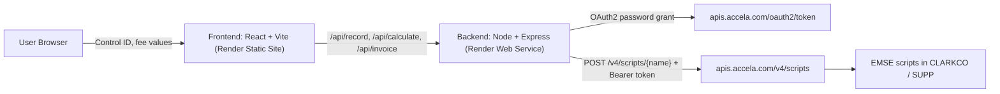

# Rapid Invoice Portal - Replacement Build

## Goal
Rebuild the Accela-embedded Rapid Invoice Portal (`clarkco.rapidinvoice`) as a standalone app hosted on Render. A user enters a `Control ID`, the page loads the renewal record + dynamic fee-value fields, calculates renewal fees, and invoices them - all by proxying three Accela EMSE scripts through a trusted Node backend. No payments in scope; all license types supported; UI must match the current Accela look.

## Architecture



The browser never sees Accela credentials. The backend caches the OAuth token (per `expires_in`) and unwraps the `data.result.result.*` envelope described in [.cursor/rules/ACCELA_EMSE_API_GUIDE.md](.cursor/rules/ACCELA_EMSE_API_GUIDE.md).

### Backend endpoints (exact EMSE script names, posted as-is)
- `GET /api/record/:controlId` -> `GET_RECORD_CUSTOM_FIELDS` (body `{ recordId }`)
- `POST /api/calculate` -> `GET_GENEREAL_RENEWAL_FEE` (body `{ recordId, feeCustomFields: [{fieldName, fieldValue}], payDate? }`)
- `POST /api/invoice` -> `INVOICE_RENEWAL_FEES` (body `{ recordId }`)

### EMSE response shapes (from the scripts in `.cursor/EMSE Scripts/`)
- `GET_RECORD_CUSTOM_FIELDS` returns: `appName`, `licenseNumber`, `renewalNumber`, `locationAddress`, `dueDate`, `gracePeriodEnd`, `delinquentDate`, and `customFieldsGroups[]` where each group has `subGroupName`, `numberOfColumns`, `customFields[]` (`fieldName`, `fieldAlias`, `oldValue` = "Last Reported", `isRequired`, `isReadOnly`, `isFeeField`). The `FEE VALUES` group drives the Reported/Adjusted/Last Reported grid.
- `GET_GENEREAL_RENEWAL_FEE` returns: `fees` (e.g. `renewalFees`, `penaltyFee`, `reinstatementFee`) and `feeItems[]` (`feeSeqNbr`, `feeAmount`, `feeCode`, `feeDescription`) -> drives the read-only System column in FEE SUMMARY.
- `INVOICE_RENEWAL_FEES` returns: `invoiceNumber`, `invoiceLink`, `messages`.

## Tech stack
- Frontend: React + TypeScript (Vite), TanStack Query (async on-blur calls), React Hook Form (dynamic grids + copy Reported->Adjusted on blur), hand-rolled CSS matching Accela (blue header, gray record banner, fee grids).
- Backend: Node + TypeScript, Express, axios, dotenv, in-memory token cache. CORS locked to the frontend origin.
- Deploy: monorepo with `render.yaml` Blueprint -> 2 services (Static Site + Web Service).

## Repo layout
```
backend/   src/{config.ts, accela/auth.ts, accela/runScript.ts, routes/{record,calculate,invoice}.ts, app.ts, server.ts}
frontend/  src/{api/client.ts, components/*, pages/RapidInvoicePage.tsx, mocks/*, styles/*}
render.yaml
README.md ARCHITECTURE.md IMPLEMENTATION_PLAN.md CHANGELOG.md .gitignore .env.example
```

## Sprints (UI-first within each; wire to live Accela SUPP after each UI phase)
- Sprint 00 - Infra/scaffold (infrastructure exception, built up front): `dev` branch, monorepo, TS configs, docs from `*.template`, `.gitignore` covering `.env*`, `render.yaml`, mock-data seam, shared TS types.
- Sprint 01 - Record lookup & display: search box + on-tab-out fetch, record banner, dynamic FEE VALUES grid. UI on mocks -> wire `GET_RECORD_CUSTOM_FIELDS`.
- Sprint 02 - Fee calculation: Reported entry, copy-to-Adjusted on blur, FEE SUMMARY (System read-only), Recalculate. UI on mocks -> wire `GET_GENEREAL_RENEWAL_FEE`.
- Sprint 03 - Invoicing: Invoice Fees button, invoice number/link + messages. UI on mocks -> wire `INVOICE_RENEWAL_FEES`.

## Per-sprint Definition of Done
Tests written + run (output shown), lint/format/type-check clean, the four docs updated in the same commits with `IMPLEMENTATION_PLAN.md`/`ARCHITECTURE.md` statuses in sync, atomic Conventional Commits on a `feature/*` branch, PR opened into `dev` (not merged locally).

## Security
Credentials only in git-ignored `.env` (local) and Render env vars (prod): `ACCELA_CLIENT_ID/SECRET`, `ACCELA_USERNAME/PASSWORD`, `ACCELA_AGENCY=CLARKCO`, `ACCELA_ENVIRONMENT=SUPP`, `ACCELA_SCOPE=run_emse_script`. `.env.example` holds placeholders only. Token never logged.

## Git workflow
Create `dev` from `main`, push as upstream. Each sprint on its own `feature/<slice>` branch off `dev`; PR into `dev` via `gh`; not merged locally.